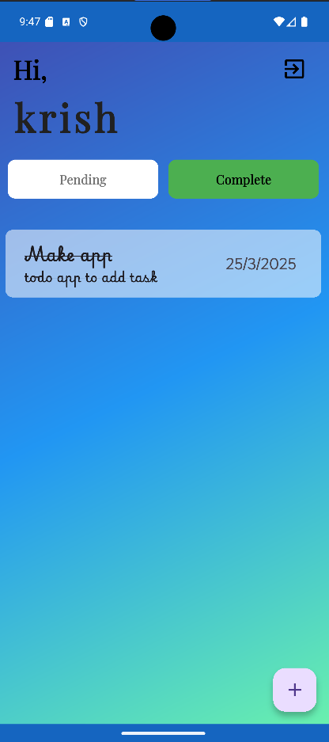
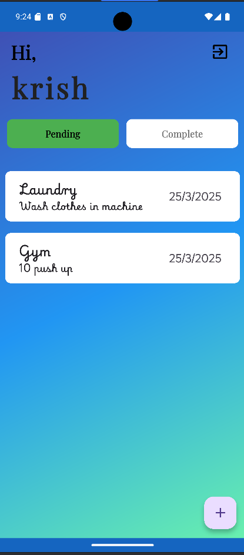
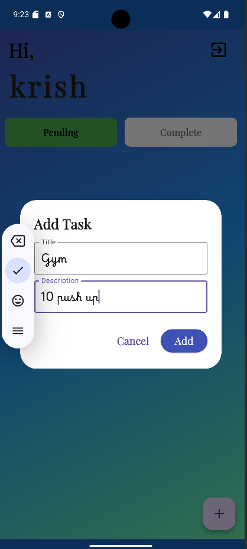
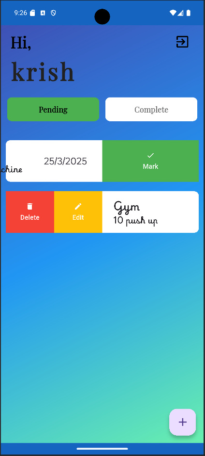
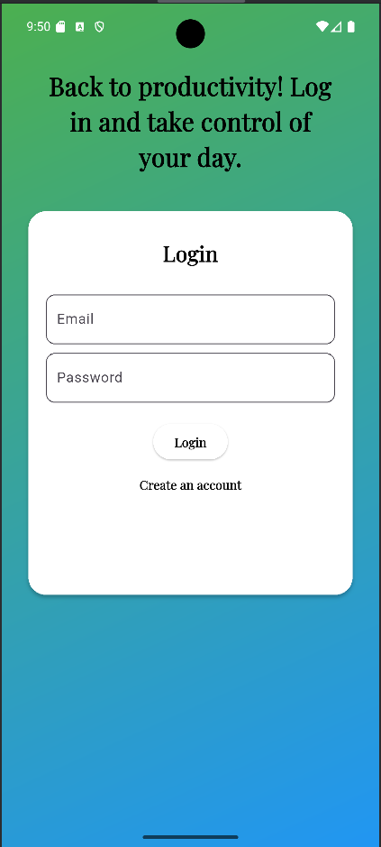
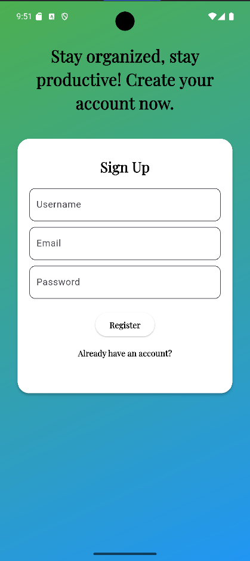

# Todo App

A simple and intuitive **Todo App** built using **Flutter**, featuring **Firebase Authentication**, **Firestore Database**, and a **Slidable feature** for managing tasks efficiently.

## Features

- ✅ **User Authentication** (Firebase Auth for Sign Up, Login, Logout)
- 📄 **Firestore Database** (Save and sync todos across devices)
- 🎭 **Slidable Feature** (Swipe to delete or update tasks)
- 📅 **Task Management** (Add, edit, delete tasks with ease)

## Screenshots

> Add relevant screenshots of the app UI here

## Installation

1. Clone the repository:
   ```sh
   git clone https://github.com/krishmaniyar/Todo-App.git
   cd Todo-App
   ```
2. Install dependencies:
   ```sh
   flutter pub get
   ```
3. Set up Firebase:
    - Create a Firebase project
    - Enable **Firestore Database** and **Authentication**
    - Download the `google-services.json` (for Android) and `GoogleService-Info.plist` (for iOS) and place them in the respective directories.

4. Run the app:
   ```sh
   flutter run
   ```

## Dependencies

- `flutter_slidable` (for swipe actions)
- `firebase_auth` (for authentication)
- `cloud_firestore` (for Firestore database)
- `provider` (for state management)

## Screenshot

### Complete Screen


### Pending Screen


### AssTask Screen


### EditTask Screen


### Login Screen


### Register Screen



## Usage

1. Sign up or log in using Firebase Authentication.
2. Add new tasks and organize your daily activities.
3. Swipe left or right on tasks to delete or edit them using the slidable feature.
4. Tasks are stored in **Firestore**, ensuring data is accessible across devices.
5. Enjoy seamless task management with dark mode support.

## Contributing

Feel free to fork the repository and submit a pull request if you find any bugs or want to add new features.

## License

This project is licensed under the MIT License.

## Author

[Krish Maniyar](https://github.com/krishmaniyar)

